# SeçGeç

SeçGeç, kullanıcıların iki seçenek arasında karar vermesine yardımcı olan, sosyal etkileşimli bir anket ve oylama platformudur. Karar veremediğin durumlarda topluluğun fikrini alabilir, görsel veya metin tabanlı anketler oluşturabilir ve tinder benzeri kaydırmalı (swipe) giao diện (interface) ile eğlenceli bir şekilde oy verebilirsin.

## Özellikler

*   **Görsel ve Eğlenceli Anketler:** İki görsel, video veya metin arasından seçim yapmaya yönelik anketler oluştur.
*   **Swipe (Kaydır-Geç) Arayüzü:** Anketleri sağa veya sola kaydırarak hızlı ve akıcı bir şekilde oylama deneyimi.
*   **Gerçek Zamanlı Oy Sonuçları:** Oy verdiğin an sonuçların ve oranların güncellenmesini canlı olarak gör.
*   **Sosyal Etkileşim:** Kullanıcıları takip et, profillerini görüntüle, anketlere yorum yap ve beğen.
*   **Anlık Mesajlaşma:** Diğer kullanıcılarla gerçek zamanlı sohbet et.
*   **Bildirimler:** Anketlerine oy geldiğinde, biri seni takip ettiğinde veya yorum yaptığında anlık bildirimler al.
*   **Capacitor Desteği:** PWA veya native mobil (iOS / Android) uygulama olarak derlenmeye uygun altyapı.


## Uygulama Görselleri

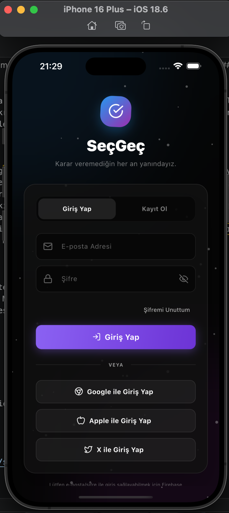
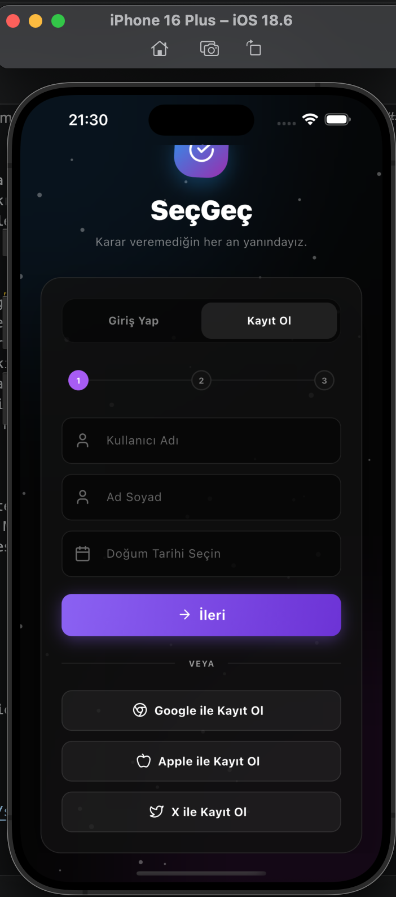
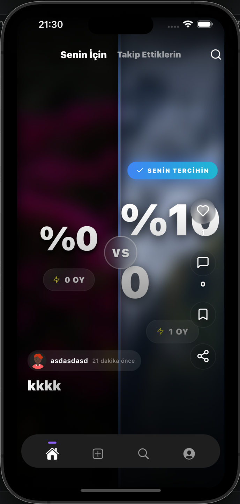
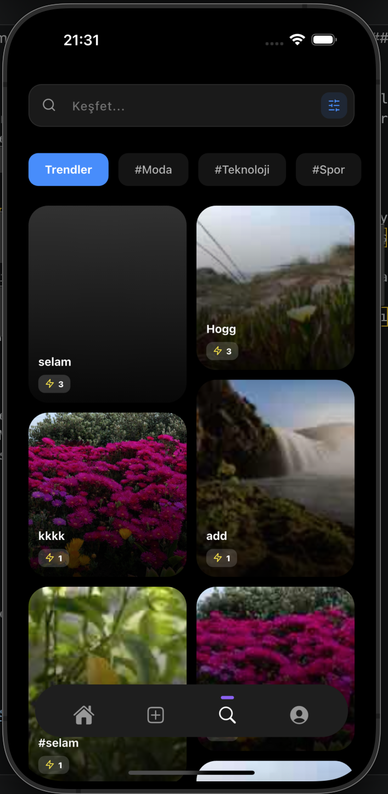
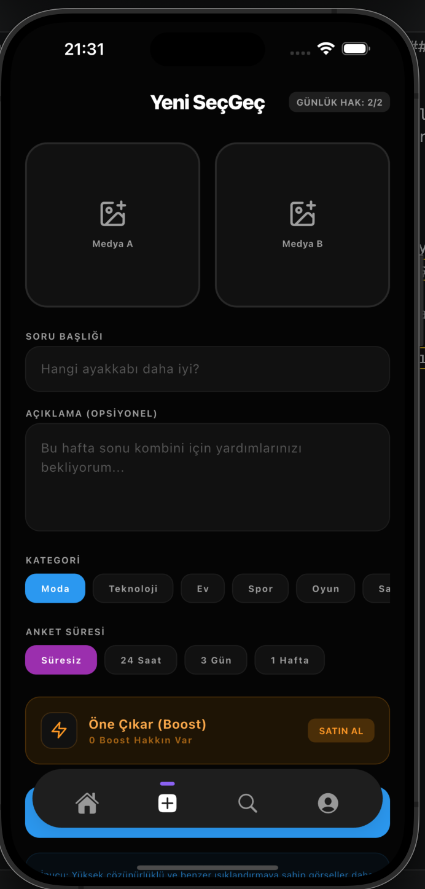
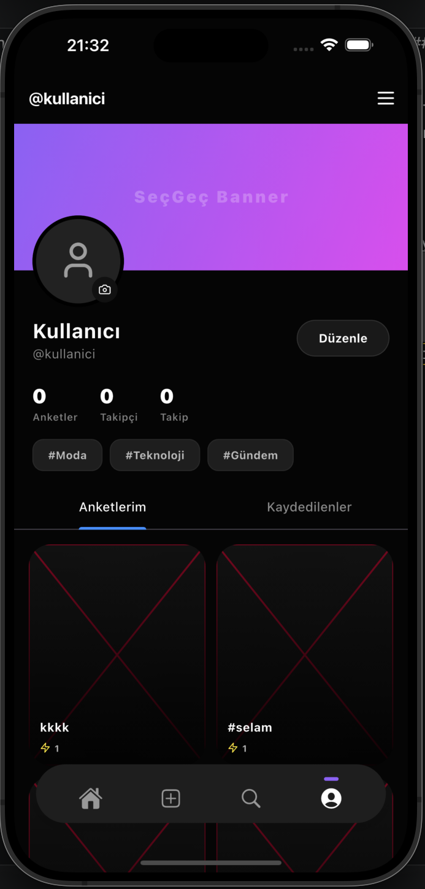
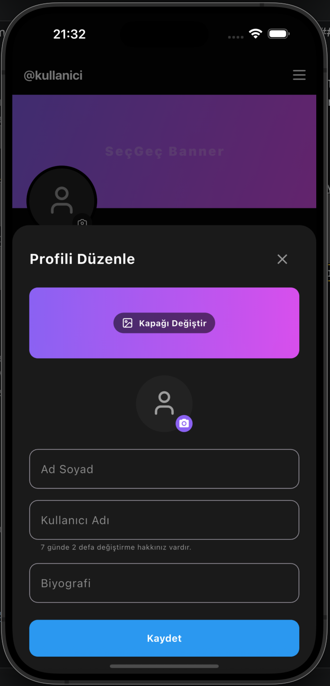
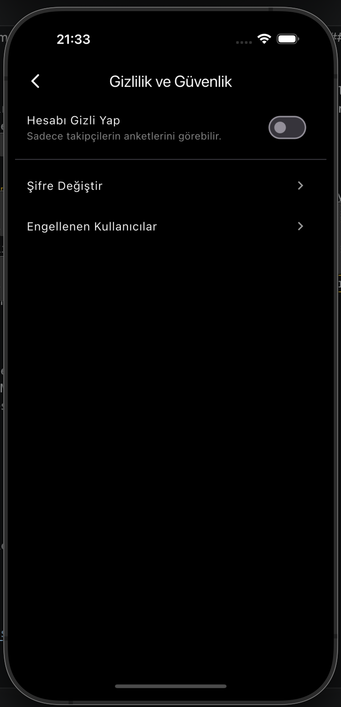
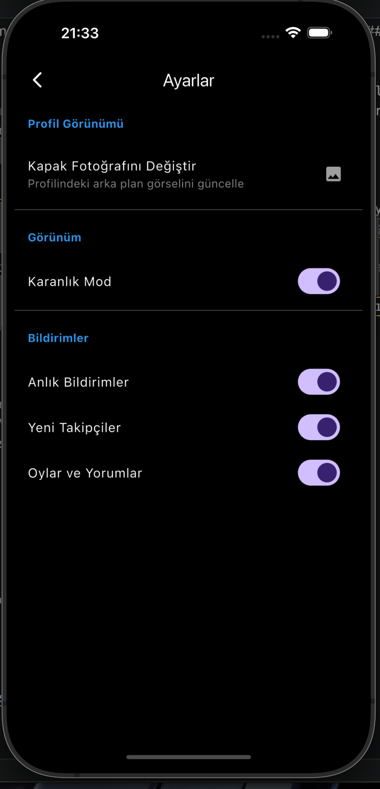
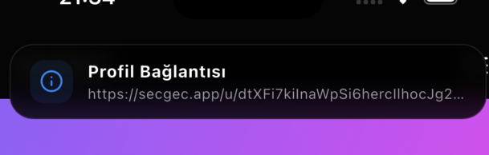
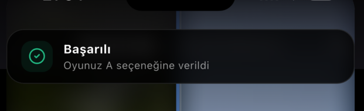


## Teknoloji Paketi

*   **Frontend:** React 19, TypeScript, Vite
*   **Stil/Tasarım:** Tailwind CSS, Framer Motion (Animasyonlar), Lucide React (İkonlar)
*   **Backend / DB / Auth:** Firebase (Firestore, Authentication)
*   **Yönlendirme:** React Router DOM (v7)

## Kurulum ve Çalıştırma

### Gereksinimler
*   Node.js (v18+)
*   npm veya yarn
*   Firebase Projesi (Firestore ve Authentication aktif edilmiş olmalı)

### 1. Depoyu Klonlayın

```bash
git clone https://github.com/zrometheusdev/secgec-mobile-app
cd secgec
```

### 2. Bağımlılıkları Yükleyin

```bash
npm install
```

### 3. Firebase Ayarlarını Yapılandırın

1.  Firebase konsolundan yeni bir web uygulaması oluşturun.
2.  Proje ana dizininde `firebase-applet-config.json` adlı bir dosya oluşturun veya mevcut dosyayı kendi bilgilerinizle güncelleyin:

```json

```

3.  Firebase Console üzerinden **Authentication** ayarlarından **Email/Password** ve (kullanmak istiyorsanız) **Google** oturum açma yöntemlerini aktifleştirin.

### 4. Firestore Güvenlik Kuralları (Önemli)

Gerçek zamanlı verilerin güvenliği için proje içerisindeki `firestore.rules` dosyasında bulunan tam teşekküllü (Attribute-Based Access Control) güvenlik kurallarını Firebase projenize (Firestore -> Rules bölümüne) kopyalayarak uygulayın.

### 5. Geliştirme Sunucusunu Başlatın

```bash
npm run dev
```


### 6. Üretime Hazırlama (Build)

```bash
npm run build
```
Bu işlem, statik dosyaları `dist` klasörü altında derleyecektir.

## Mobil Uygulama Olarak Derleme (Capacitor)

Proje Capacitor entegrasyonu ile native Android ve iOS uygulaması haline getirilebilir.
**(Not: Google Login Capacitor tarafında native eklentiler gerektirebilir, standart e-posta girişi tüm platformlarda sorunsuz çalışır).**

```bash
# Capacitor CLI'ı kurun
npm install @capacitor/cli @capacitor/core

# Projeye Capacitor ekleyin
npx cap init

# Android/iOS platformlarını ekleyin
npm install @capacitor/android @capacitor/ios
npx cap add android
npx cap add ios

# Build alın ve projeyi mobil klasörlere eşitleyin
npm run build
npx cap sync

# Android Studio veya Xcode ile açın
npx cap open android
npx cap open ios
```

## Güvenlik Analizi
Bu proje sağlam Firestore güvenlik ve doğrulama denetimlerini içeren güçlü bir backend mimarisi ile donatılmıştır (`firestore.rules`). Bütün işlemler şema doğrulamasından ve rol bazlı erişim denetimlerinden geçmektedir.

## Katkıda Bulunma
Projeye katkıda bulunmak isterseniz lütfen "Pull Request" oluşturmadan önce ilgili sorunu (issue) tartışmaya açın.

## Lisans
Bu proje [MIT Lisansı](LICENSE) altında lisanslanmıştır.